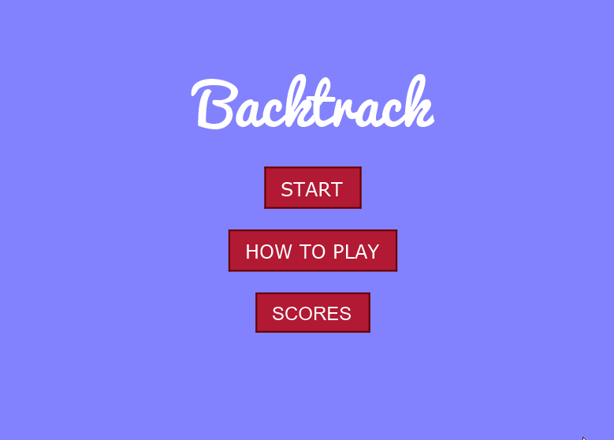
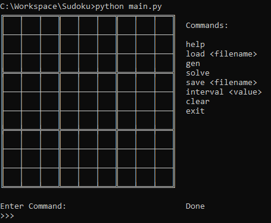
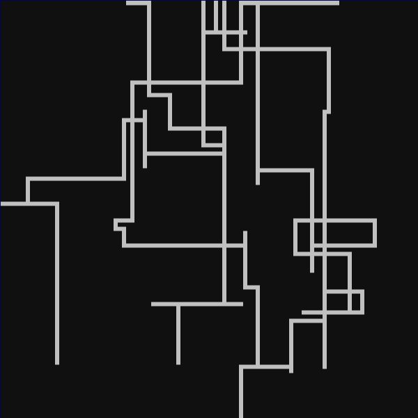
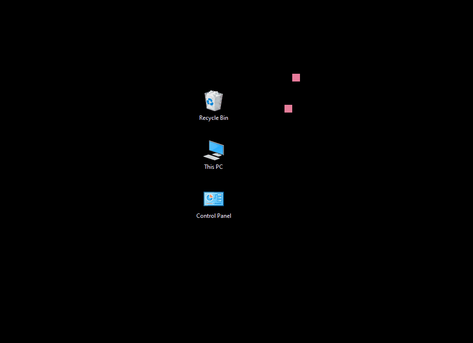

# Louis Alban Ziko (peTheProgrammer)

## My Projects

- [Backtrack](https://github.com/LouisAlbanZiko/Backtrack)

A 2D platformer where the player can go back in time 2 seconds.

- [Pong](https://github.com/LouisAlbanZiko/Pong)

A clone of Pong I made in highschool.

- [Sudoku Solver](https://github.com/LouisAlbanZiko/Sudoku)

A command line program which can solve sudoku using brute force.

- [Maze Solver](https://github.com/LouisAlbanZiko/maze_solver)

Depth First Search algorithm for solving mazes with a [demo](https://louisalbanziko.github.io/maze_solver/index.html)

- [Desktop Background Simulation](https://github.com/LouisAlbanZiko/desktop_sim)

A [verlet physics](https://en.wikipedia.org/wiki/Verlet_integration) simulation which gets displayed on the desktop background.

